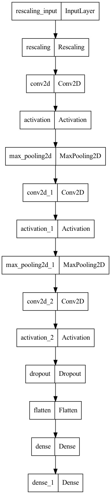

# undergrad-final-project-2022

Improved version of my final undergraduate project.

To run the model and evaluate it, just run

`make run`

To perform the emotion recognition task using your camera, run

`make cam`

which will enable you to do a live emotion recognition based on your own facial expressions :smiley:

More about the commands inside the Makefile (about run, download, install and more).

It will download the FER2013 dataset from Kaggle, transform it into images (that can be
visualized by the user inside its folders), and later will serve as the input for the machine learning model.

# Sample Images from TestSet

# Architecture of the model

# Results of the model

The results are presented as percentages.

### TODO
### Future Improvements

- [x] Hyperparameter Optimization
- [ ] Data Augmentation
- [ ] Use Another Dataset to improve results
- [x] Architecture Optimization
- [x] Transfer Learning

These are all possible improvements for this approach, while the 2nd and 3rd seems to be the most promissing, at a first glance. The 1st, 4th and 5th possible improvements were tested, but not significant improvements were assessed during the experiments.
